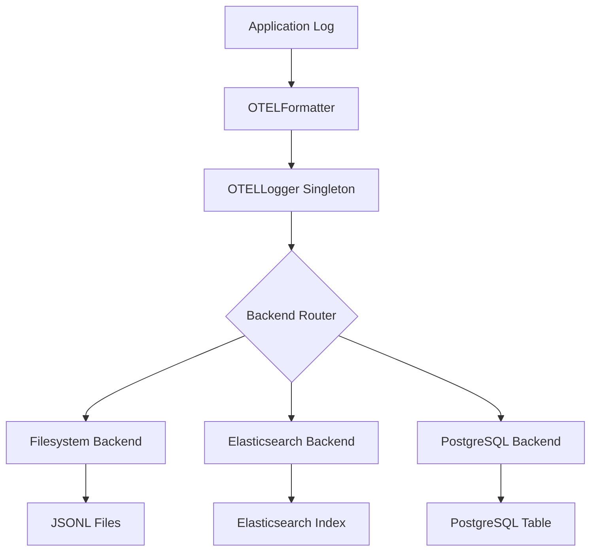

# 🚀 OpenTelemetry Logging Framework

> A comprehensive, production-ready logging framework for Python applications with OpenTelemetry compliance, multiple backends, and distributed tracing capabilities.

## 📋 Table of Contents

- [🔍 Overview](#-overview)
- [✨ Key Features](#-key-features)
- [🏗️ Architecture](#️-architecture)
- [📦 Installation](#-installation)
- [⚙️ Configuration](#️-configuration)
- [🎯 Usage](#-usage)
- [🔧 Backends](#-backends)
- [🛡️ Error Handling](#️-error-handling)
- [🚀 Next Level Features](#-next-level-features)
- [🔄 Next Steps](#-next-steps)
- [📖 Example Application](#-example-application)
- [🔧 Troubleshooting](#-troubleshooting)

---

## 🔍 Overview

The **OpenTelemetry Logging Framework** (`otel_logger`) is a powerful Python module that brings enterprise-grade structured logging and distributed tracing to your applications. Built with OpenTelemetry standards in mind, it provides seamless integration with multiple storage backends and robust error handling.

### 🎯 Perfect For:
- **Microservices** requiring distributed tracing
- **High-volume applications** needing structured observability
- **Production systems** demanding reliability and performance
- **Development teams** seeking flexible, extensible logging solutions

---

## ✨ Key Features

### 🏷️ Structured Logging
- **OpenTelemetry Compliant**: JSON format with `timestamp`, `severity_text`, `trace_id`, `span_id`, and more
- **Rich Metadata**: Automatic resource detection and custom attributes support

### 🔄 Multiple Backends
- **Filesystem**: Rotating JSONL files with thread-safe operations
- **Elasticsearch**: Direct indexing with template management
- **PostgreSQL**: Structured table storage with performance indices
- **Extensible**: Easy to add custom backends via abstract interface

### 🔍 Distributed Tracing
- **Decorators**: `@otel_trace` and `@otel_log` for seamless integration
- **Context Managers**: `otel_span` for manual span management
- **Correlation IDs**: Request tracking across service boundaries

### ⚙️ Configuration-Driven
- **YAML Configuration**: Centralized settings management
- **Environment Variables**: Secure credential handling
- **Hot Reloading**: Dynamic configuration updates

### 🛡️ Production-Ready
- **Fallback Mechanisms**: Automatic failover to filesystem backend
- **Thread Safety**: Concurrent operation support
- **Error Resilience**: Graceful degradation and comprehensive error handling

---

## 🏗️ Architecture

### 📁 Project Structure
```
otel-logging-framework/
├── otel_types.py          # Core types and interfaces
├── otel_logger.py         # Main logging implementation
├── handlers/
│   ├── debug.py          # Internal diagnostics
│   ├── filesystem.py     # File-based logging
│   ├── elasticsearch.py  # Elasticsearch integration
│   └── postgres.py       # PostgreSQL backend
├── logger_config.yaml    # Configuration file
└── .env                  # Environment variables
```

### 🔄 Logging Pipeline


---

## 📦 Installation

### 1. 📥 Clone Repository
```bash
git clone <repository_url>
cd my-otel-project
```

### 2. 🐍 Virtual Environment
```bash
python -m venv venv
source venv/bin/activate  # On Windows: venv\Scripts\activate
```

### 3. 📚 Dependencies
```bash
pip install pyyaml filelock elasticsearch==9.0.2 psycopg2-binary
```

### 4. 🔐 Environment Setup
```bash
# Create .env file
cat > .env << EOF
ELASTIC_PASSWORD=your_elasticsearch_password
POSTGRES_PASSWORD=your_postgres_password
EOF
```

### 5. ⚙️ Configuration
Create `logger_config.yaml` in your project root (see configuration section below).

---

## ⚙️ Configuration

### 📝 Complete Configuration Example

```yaml
logger:
  service_name: "my-service"
  service_version: "1.0.0"
  log_level: "DEBUG"
  enable_console: true
  
  backends:
    # 📁 Filesystem Backend
    - backend_type: "filesystem"
      config:
        log_file: "./logs/my-service.jsonl"
        max_bytes: 10485760  # 10MB
        backup_count: 5
    
    # 🔍 Elasticsearch Backend
    - backend_type: "elasticsearch"
      config:
        hosts: ["https://localhost:9200"]
        index_pattern: "my-app-logs-%Y.%m.%d"
        basic_auth: ["elastic", "$ELASTIC_PASSWORD"]
        ca_certs: "/path/to/http_ca.crt"
        verify_certs: true
        timeout: 30
        max_retries: 3
        retry_delay: 2
    
    # 🐘 PostgreSQL Backend
    - backend_type: "postgres"
      config:
        host: "localhost"
        port: 5432
        database: "logs"
        user: "postgres"
        password: "$POSTGRES_PASSWORD"
        table_name: "otel_logs"
```

### 📊 Configuration Reference

| Field | Type | Default | Description |
|-------|------|---------|-------------|
| `service_name` | `string` | `"blueprint-framework"` | Service identifier |
| `service_version` | `string` | `"1.0.0"` | Service version |
| `log_level` | `string` | `"INFO"` | Minimum log level |
| `enable_console` | `boolean` | `true` | Console output toggle |
| `backends` | `array` | `[]` | Backend configurations |

---

## 🎯 Usage

### 🚀 Basic Logging

```python
from otel_logger import configure_logger, log_info, log_error

# Initialize logger
logger = configure_logger(config_file="logger_config.yaml")

# Log with attributes
log_info("Application started", attributes={"user_id": "user123"})
log_error("Database connection failed", attributes={"error_code": "DB001"})

# Clean shutdown
logger.close()
```

### 🔍 Distributed Tracing with `@otel_trace`

```python
from otel_logger import configure_logger, otel_trace

logger = configure_logger(config_file="logger_config.yaml")

@otel_trace(operation_name="calculate_price", correlation_id="req-001")
def calculate_price(base_price: float, discount: float = 0.0) -> float:
    """Calculate discounted price with automatic tracing."""
    return base_price * (1 - discount)

# Usage
result = calculate_price(100.0, 0.15)
print(f"Calculated price: ${result}")

logger.close()
```

**📊 Generated Log Output:**
```json
{
  "timestamp": "2025-07-06T10:34:56.123456Z",
  "severity_text": "INFO",
  "severity_number": 9,
  "body": "Starting operation: calculate_price",
  "trace_id": "abcdef1234567890abcdef1234567890",
  "span_id": "1234567890abcdef",
  "attributes": {
    "operation.name": "calculate_price",
    "function.name": "calculate_price",
    "function.module": "__main__",
    "function.args": {"base_price": "100.0", "discount": "0.15"},
    "correlation_id": "req-001"
  }
}
```

### 🎨 Custom Logging with `@otel_log`

```python
from otel_logger import configure_logger, otel_log

logger = configure_logger(config_file="logger_config.yaml")

@otel_log(level="INFO", message="Processing data", correlation_id="req-002")
def process_data(data: list) -> dict:
    """Process data with custom logging."""
    return {"processed": len(data), "data": data}

# Usage
result = process_data([1, 2, 3, 4, 5])
print(f"Result: {result}")

logger.close()
```

### 🔧 Manual Span Management with `otel_span`

```python
from otel_logger import configure_logger, otel_span, log_info

logger = configure_logger(config_file="logger_config.yaml")

# Context manager for manual span control
with otel_span("data_processing", attributes={"batch_size": 100}, correlation_id="req-003"):
    log_info("Processing batch", batch_id="batch_001", size=100)
    # Your processing logic here
    log_info("Batch processing completed")

logger.close()
```

---

## 🔧 Backends

### 📁 Filesystem Backend

**Purpose**: Thread-safe logging to rotating JSONL files

**Features**:
- 🔄 Automatic log rotation
- 🔒 Thread-safe operations with file locking
- 📊 Asynchronous queue-based writes
- 📈 Configurable file size and backup retention

**Configuration**:
```yaml
backend_type: "filesystem"
config:
  log_file: "./logs/my-service.jsonl"
  max_bytes: 10485760  # 10MB
  backup_count: 5
```

### 🔍 Elasticsearch Backend

**Purpose**: Real-time log indexing and searching

**Features**:
- 🎯 Dynamic index patterns (daily/monthly rotation)
- 🔧 Automatic index template creation
- 🔄 Retry logic with exponential backoff
- 🔐 SSL/TLS support with certificate validation

**Configuration**:
```yaml
backend_type: "elasticsearch"
config:
  hosts: ["https://localhost:9200"]
  index_pattern: "my-app-logs-%Y.%m.%d"
  basic_auth: ["elastic", "$ELASTIC_PASSWORD"]
  ca_certs: "/path/to/http_ca.crt"
  verify_certs: true
  timeout: 30
  max_retries: 3
  retry_delay: 2
```

### 🐘 PostgreSQL Backend

**Purpose**: Structured relational log storage

**Features**:
- 📊 Optimized table schema with indices
- 🔍 Fast queries on timestamp, trace_id, and severity
- 🔄 Connection pooling support
- 📈 JSONB storage for attributes

**Configuration**:
```yaml
backend_type: "postgres"
config:
  host: "localhost"
  port: 5432
  database: "logs"
  user: "postgres"
  password: "$POSTGRES_PASSWORD"
  table_name: "otel_logs"
```

**Database Schema**:
```sql
CREATE TABLE otel_logs (
    id SERIAL PRIMARY KEY,
    timestamp TIMESTAMPTZ,
    severity_text VARCHAR(20),
    severity_number INTEGER,
    body TEXT,
    trace_id VARCHAR(32),
    span_id VARCHAR(16),
    resource JSONB,
    attributes JSONB
);

-- Performance indices
CREATE INDEX idx_otel_logs_timestamp ON otel_logs(timestamp);
CREATE INDEX idx_otel_logs_trace_id ON otel_logs(trace_id);
CREATE INDEX idx_otel_logs_severity ON otel_logs(severity_text);
```

---

## 🛡️ Error Handling

### 🔄 Automatic Fallback
- **Backend Failure**: Automatically falls back to filesystem backend
- **Configuration Issues**: Uses sensible defaults
- **Network Problems**: Retries with exponential backoff

### 📊 Error Monitoring
- **Debug Logging**: Internal diagnostics via `debug.py`
- **Console Fallback**: Critical errors printed to console
- **Graceful Degradation**: Never blocks application execution

### 🔍 Example Error Handling
```python
# If Elasticsearch is down, logs automatically go to filesystem
try:
    log_info("User login", user_id="user123")
except Exception as e:
    # Framework handles this internally
    # Logs will be written to fallback backend
    pass
```

---

## 🚀 Next Level Features

### ⚡ Asynchronous Operations

Transform your logging pipeline for high-performance applications:

```python
# Future async implementation
import asyncio
from aiofile import async_open

class AsyncFilesystemBackend(LogBackendInterface):
    async def write_log(self, log_entry: Dict[str, Any]) -> None:
        async with async_open(self.log_file, 'a') as f:
            await f.write(json.dumps(log_entry, default=str) + '\n')
```

### 🔄 Kafka Integration

Scale to handle millions of logs with message queuing:

```python
from confluent_kafka import Producer

class KafkaBackend(LogBackendInterface):
    def initialize(self, config: Dict[str, Any]) -> None:
        self.producer = Producer({
            'bootstrap.servers': config.get('bootstrap_servers', 'localhost:9092')
        })
    
    def write_log(self, log_entry: Dict[str, Any]) -> None:
        self.producer.produce('otel-logs', json.dumps(log_entry).encode())
```

### 👥 Multi-User Support

Enhanced correlation and user tracking:

```python
# Multi-tenant logging
log_info("User action", attributes={
    "user_id": "user123",
    "tenant_id": "tenant_456",
    "session_id": "session_789",
    "action": "login"
}, correlation_id="req-001")
```

### 📈 Performance Optimization

- **Batch Processing**: Collect and flush logs in batches
- **Connection Pooling**: Reuse database connections
- **Compression**: Compress log data before storage
- **Metrics Integration**: Monitor logging performance

---

## 🔄 Next Steps

### 1. 🚀 Async Implementation
- [ ] Convert all backends to async/await
- [ ] Implement `AsyncOTELLogger` class
- [ ] Add `aiofile`, `elasticsearch-async`, `asyncpg` support

### 2. 📊 Enhanced Monitoring
- [ ] OpenTelemetry metrics integration
- [ ] Performance dashboards
- [ ] Alert mechanisms for backend failures

### 3. 🔧 Advanced Features
- [ ] Configuration validation with JSON Schema
- [ ] Plugin system for custom backends
- [ ] Rate limiting and quota management

### 4. 🧪 Testing & Quality
- [ ] Comprehensive unit test suite
- [ ] Integration tests with real backends
- [ ] Performance benchmarking

### 5. 📖 Documentation
- [ ] API reference documentation
- [ ] Deployment guides
- [ ] Best practices handbook

---

## 📖 Example Application

### 🌐 FastAPI Integration

```python
from fastapi import FastAPI, Request
from otel_logger import configure_logger, otel_trace, log_info
import uuid

app = FastAPI(title="Price Calculator API")
logger = configure_logger(config_file="logger_config.yaml")

@app.middleware("http")
async def logging_middleware(request: Request, call_next):
    correlation_id = str(uuid.uuid4()).replace("-", "")
    request.state.correlation_id = correlation_id
    
    log_info("Request received", attributes={
        "method": request.method,
        "url": str(request.url),
        "client_ip": request.client.host
    }, correlation_id=correlation_id)
    
    response = await call_next(request)
    return response

@app.get("/price/{base_price}")
@otel_trace(operation_name="calculate_price_endpoint")
async def calculate_price(base_price: float, discount: float = 0.0, request: Request = None):
    correlation_id = request.state.correlation_id
    
    log_info("Calculating price", attributes={
        "base_price": base_price,
        "discount": discount
    }, correlation_id=correlation_id)
    
    result = base_price * (1 - discount)
    
    log_info("Price calculated", attributes={
        "result": result
    }, correlation_id=correlation_id)
    
    return {"price": result, "correlation_id": correlation_id}

@app.on_event("shutdown")
async def shutdown_event():
    logger.close()

if __name__ == "__main__":
    import uvicorn
    uvicorn.run(app, host="0.0.0.0", port=8000)
```

### 🚀 Running the Application

```bash
# Install dependencies
pip install fastapi uvicorn

# Run the application
uvicorn app:app --host 0.0.0.0 --port 8000 --reload

# Test the API
curl "http://localhost:8000/price/100?discount=0.15"
```

**Response:**
```json
{
  "price": 85.0,
  "correlation_id": "a1b2c3d4e5f6"
}
```

---

## 🔧 Troubleshooting

### ❌ Common Issues

#### 🔐 Elasticsearch Authentication
**Problem**: Authentication failed
```bash
# Test connection
curl -u elastic:$ELASTIC_PASSWORD --cacert /path/to/http_ca.crt https://localhost:9200/
```

**Solution**: Verify credentials in `.env` file

#### 📂 File Permission Errors
**Problem**: Cannot write to log directory
```bash
# Fix permissions
mkdir -p logs
chmod 755 logs
```

#### 🐘 PostgreSQL Connection Issues
**Problem**: Database connection refused
```bash
# Check PostgreSQL status
pg_isready -h localhost -p 5432
```

**Solution**: Ensure PostgreSQL is running and accessible

### 🔍 Debug Mode

Enable detailed logging for troubleshooting:

```python
import logging
logging.basicConfig(level=logging.DEBUG)

# Your logging code here
```

### 📊 Health Checks

```python
from otel_logger import configure_logger

def health_check():
    """Check if logging backends are healthy."""
    logger = configure_logger()
    
    try:
        log_info("Health check", attributes={"check": "backend_connectivity"})
        return {"status": "healthy", "backends": "operational"}
    except Exception as e:
        return {"status": "degraded", "error": str(e)}
```

---

## 🎯 Conclusion

The OpenTelemetry Logging Framework provides a solid foundation for enterprise-grade logging in Python applications. With its multi-backend support, distributed tracing capabilities, and production-ready features, it's designed to grow with your application from development to scale.

> 💡 **Pro Tip**: Start with the filesystem backend for development, then add Elasticsearch for production observability and PostgreSQL for compliance requirements.

---

*Built  for the Python community*